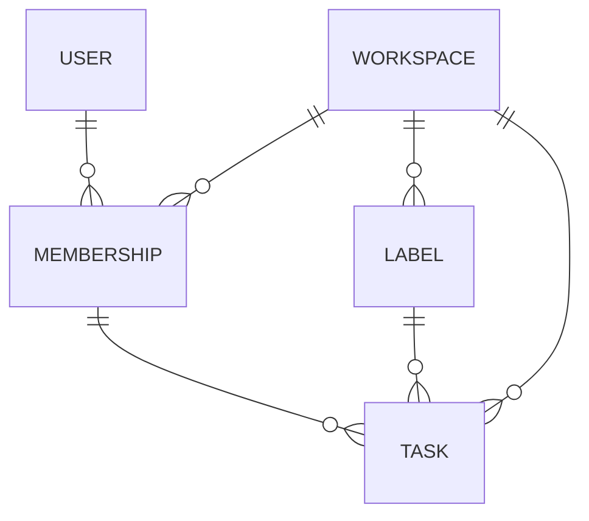
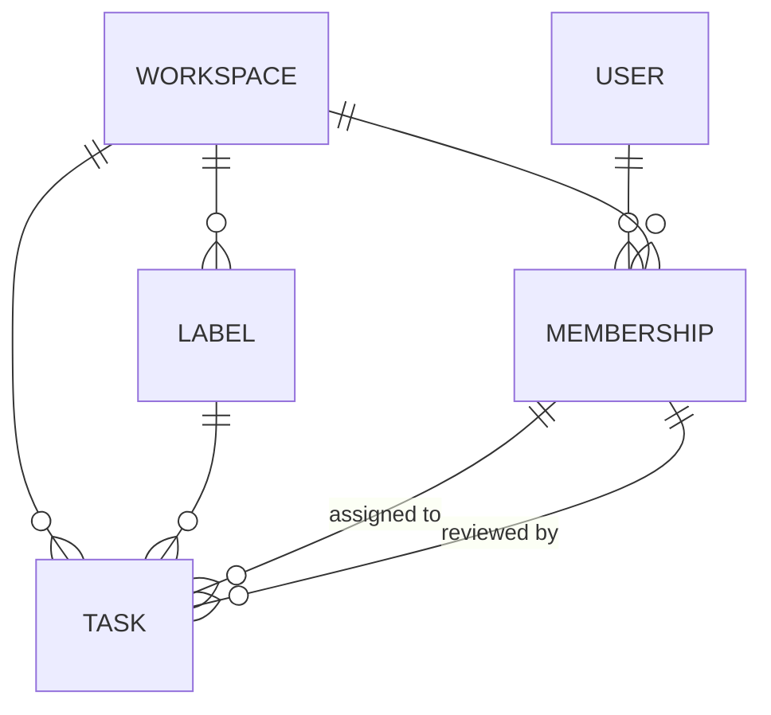
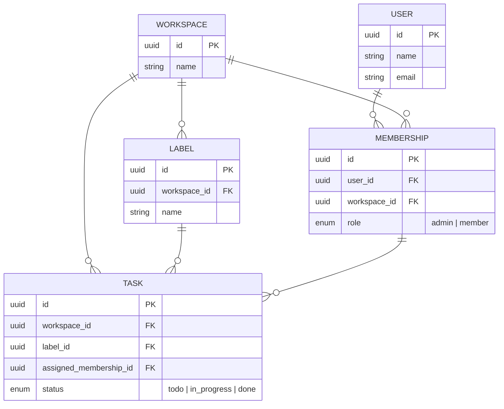

# Worked example: a generic task-tracking domain

This walks through the conventions in SKILL.md against a made-up, generic domain (a small team task tracker), so the patterns are visible outside of any one real project.

## Starting input

Say the user describes: "Users belong to one or more workspaces. Within a workspace, each user has a role. Tasks belong to a workspace, have a status, and can be assigned to a user. Workspaces have custom labels they can attach to tasks."

## Step 1 — elicit in prose, surface the forks

Before drawing anything:

- **Pivot entity**: "user belongs to one or more workspaces, with a role within it" is a many-to-many with attached data (the role) — model a `Membership` entity between `User` and `Workspace`, rather than a `role` column duplicated onto some other table.
- **Catalog vs. enum**: "workspaces have custom labels" — since labels are workspace-specific and user-defined, model `Label` as its own entity scoped to `Workspace`, not a hardcoded enum. Contrast with `Task.status`, which sounds like a small, structurally fixed set (e.g. `todo | in_progress | done`) shared by every workspace — that one's a real enum.
- **Ownership vs. assignment**: nothing else surfaced here, but if this domain later distinguished "who created the task" from "who it's assigned to," those would be two separate relationships to `User`, not one overloaded field.

Confirm this reading with the user before rendering.

## Step 2 — simplified diagram (default)

Notes on why this looks the way it does:
- No attribute blocks anywhere — just entity names, so no empty compartments render.
- Every relationship label is empty, because no entity pair here has more than one distinct relationship between them.
- Cardinalities are still fully present (`||--o{`) — that's the actual modeling content, never dropped even in simplified mode.

## Step 3 — what a duplicate link would look like

If the domain grew a `reviewed_by` concept on `Task` — a different membership from the assignee — that pair would need disambiguation, while everything else stays unlabeled:

## Step 4 — detailed version (only on explicit request)

## Step 5 — derived data, called out rather than modeled

If the user also wanted "how many open tasks does this workspace have," that's a count computed from `Task.status`, not a field on `Workspace` — it gets a one-line note alongside the diagram (e.g. "Open task count is derived per workspace from `Task.status`, never stored") rather than a column.

## Step 6 — YAGNI on an undesigned subsystem

If the user mentions "workspaces will eventually have configurable notification rules, but we haven't figured out the shape yet," the right move is to leave `Workspace` without any notification-related field at all — not to add a `notification_config: json` placeholder. Note it in prose as a known gap, and add the real field(s) once that subsystem is actually designed.
